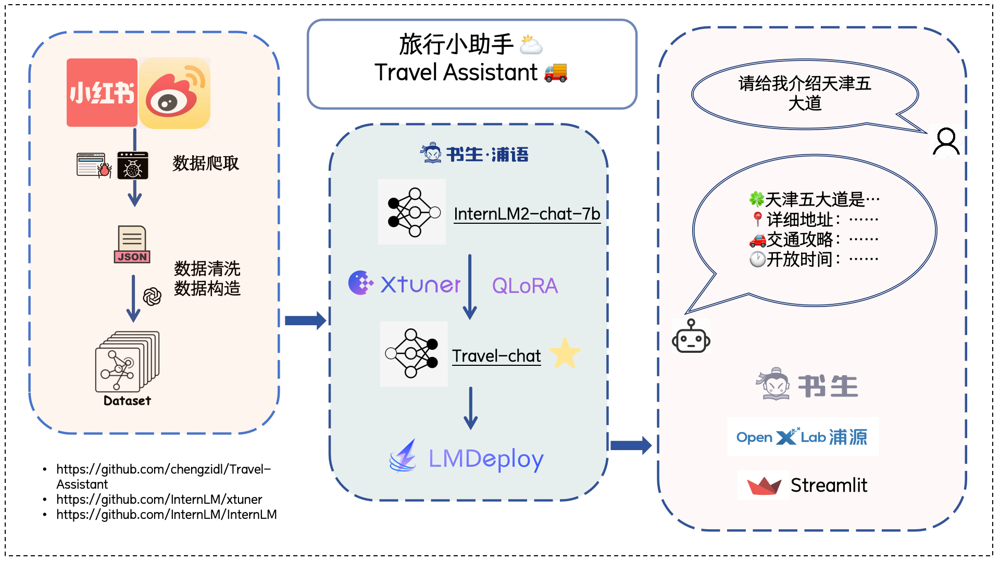

# 旅行小助手

## 📖 项目概述
&emsp;&emsp; 旅行小助手✈️是基于 [InternLM2-chat-7b](https://github.com/InternLM/InternLM.git) 进行LoRA微调而得，数据集利用 [MediaCrawler](https://github.com/NanmiCoder/MediaCrawler) 从小红书/微博/抖音平台爬取。
&emsp;&emsp; 旅行小助手整合了网上的旅行攻略、美食景点、旅行注意事项等，以轻松活泼的对话方式给游客答疑解惑。当你在为即将到来的旅行做攻略，焦头烂额时，不妨试试这个小助手吧～

### 🏷️ 项目架构图
<p align="center">
    
</p>

### 😊 主要功能
- **查询景点**
- **景点查询**
- **交通方式查询**
- **住宿查询**
- **当地美食及其店铺查询**
- **注意事项查询（防晒、防雨、高反等）**

### 🚩 项目愿景
减少出门旅行做攻略的时间，问任何关于旅行的事情都可以从模型获取，并且保证信息的时效性和真实性。

## 🚀 快速开始
<!-- ## 微调 -->
#### 1. 下载本项目到本地
```bash
git clone git@github.com:chengzidl/Travel-Assistant.git
cd Travel-Assistant
```
#### 2. 创建环境
```bash
# conda 
conda create -n ta python==3.10
conda activate ta
# 安装依赖
pip install -r requirements.txt
```

#### 3. 下载模型

#### 4. 本地部署
```bash
sh run_demo.sh
```
#### 5. 重新微调
在微调前，建议将数据集放在 data 目录下，也可以修改配置文件 `internlm2_chat_7b_qlora_alpaca_e3.py`
```bash
cd train
sh train.sh
```
